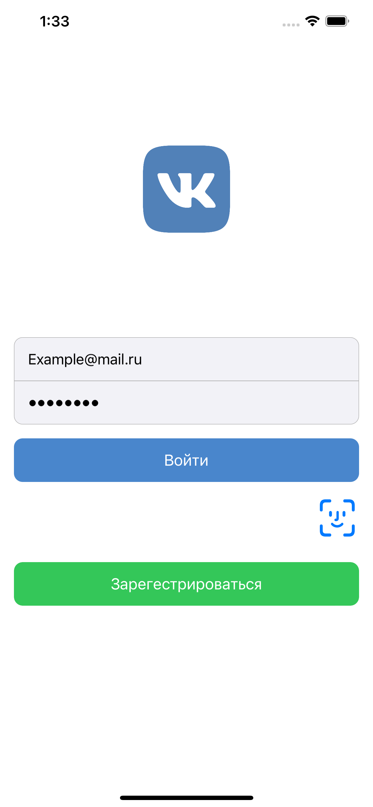
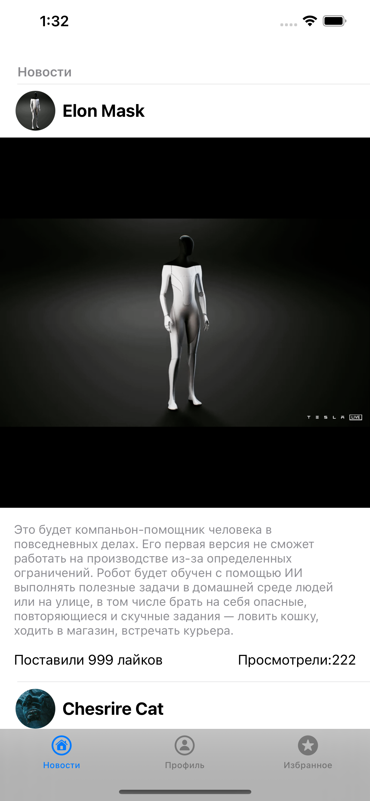
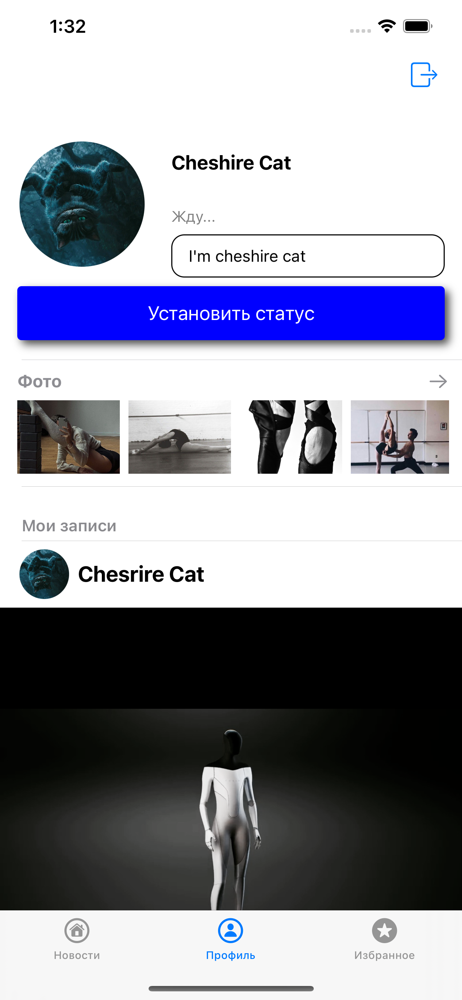
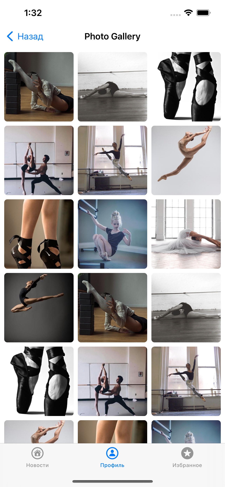
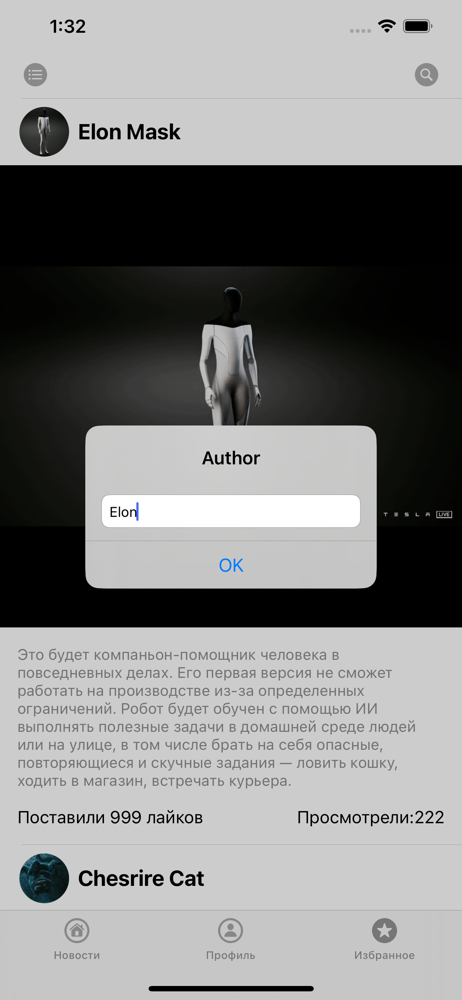

# VK

     
 

 
## Проект создания приложения на базе интерфейса социальной сети Вконтакте

## Функционал

- Вход в приложение через FaceID
- Авторизация через Realm или FireBase
- Шифрование данных Realm 
- Просмотр ленты новостей 
- Добавление понравившихся постов в избранное
- Поиск избранных постов по имени автора
- Просмотр галереи фотографиий пользователя
- Поддержка темной/светлой темы
- Локализация - поддержка русского и английского языков

**Проект написан с использованием архитиктуры MVVM + Coordinator.**

 # Pods for VK
  - pod 'SnapKit', '~> 5.0.0'
  - pod 'FirebaseAuth'
  - pod 'Firebase/Core'
  - pod 'RealmSwift'
  
# Интерфейс приложения

## Экран входа

     

## Новости

     

  
## Профиль

     

  
## Галерея

     

  
## Поиск по избранному

     

